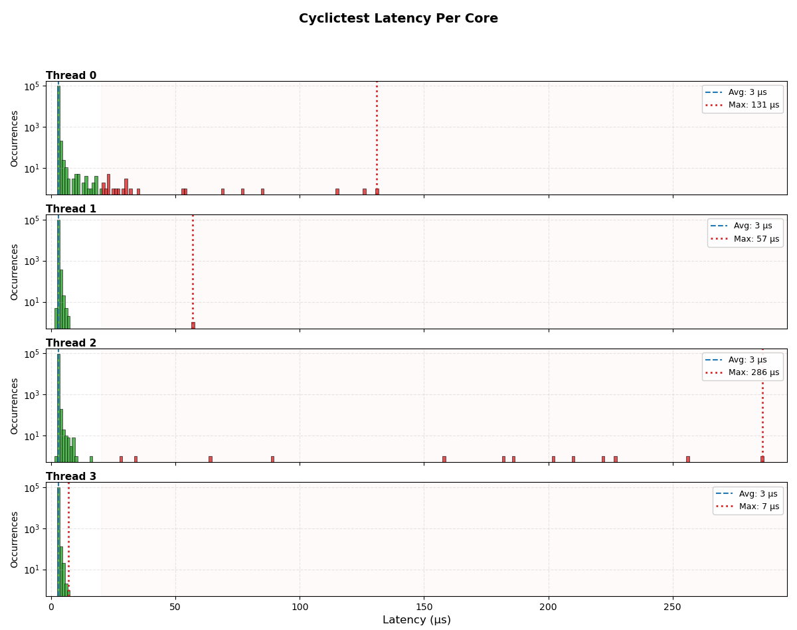
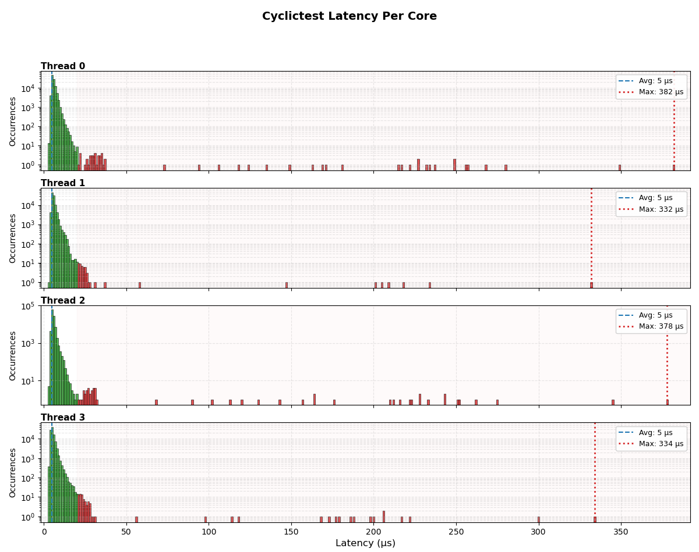

# System Status
- Host: robot-controller.local
- User: snoopy
- Access with:
```bash
ssh snoopy@robot-controller
``` 
(or ssh snoopy@robot-controller.local without DNS Server)
Copy ssh key to remote machine for no-pw on login:
```bash
ssh-copy-id snoopy@robot-controller
```

# Robot Controller Setup Guide
This document logs the step-by-step installation and configuration process of transforming a dedicated Mini-PC into a real-time capable robot controller running Ubuntu Server.
### 1. Installation Media Preparation
- OS Image: Downloaded the official Ubuntu Server ISO (LTS version).
- Bootable Drive: Flashed the ISO onto a USB thumb drive using a tool.

### 2. Ubuntu Server Installation Phase
During the initial boot from the USB drive, the following critical installation choices were made in the setup process:

- Storage Configuration: Selected the option to utilize the entire local SSD to ensure maximum storage capacity and clean partition layouts.
- Network Connectivity: The device should be connected to a working network during the installation process, or Ubuntu's network configuration framework (Netplan/systemd-networkd) will fail to setup properly.
- SSH Server: Explicitly checked the box to install and enable the OpenSSH Server during the wizard. This eliminates the need for a permanent monitor and keyboard on the Mini-PC after installation.

# Realtime Robot Controller Setup
The following steps must be taken to meet real-time requirements and run ros software.

### Upgrading to a Real-Time Kernel (PREEMPT_RT)
To ensure highly deterministic execution loops required for low-level motor controls and sensor processing, the standard kernel was upgraded to a Hard Real-Time Kernel.
Steps Taken:

1. Ubuntu Pro Attachment: Registered a free personal account on ubuntu.com/pro and linked the machine via:
```bash
sudo pro attach <YOUR_TOKEN>
```
2. Enabling Real-Time: Executed the real-time installation command:
```bash
sudo pro enable real-time-kernel
```

### Disabling Power Saving & Sleep Modes
To guarantee that the robot controller remains 100% operational and accessible at all times, all OS-level suspension and sleep targets were permanently masked. This prevents the Mini-PC from entering any power-saving states during headless execution.
```bash
sudo systemctl mask sleep.target suspend.target hibernate.target hybrid-sleep.target
```

###  Docker Setup

This project runs inside Docker containers to ensure environment consistency and easy deployment across different machines.
Install Docker using the native `docker.io` package:

```bash
sudo apt install -y docker.io
```
By default, Docker commands require root privileges (sudo). To run Docker as a non-root user, add your current user to the docker group:
```bash
sudo usermod -aG docker $USER
```
> Important: After running this command, log out and log back in (or restart your terminal / SSH session) for the changes to take effect!

To achieve deterministic execution and allow ros2_control to run high-priority real-time loops inside a Docker container, you must configure both the Dockerfile and the Runtime Flags:
#### Container Runtime Flags (Crucial)
A standard Docker container restricts real-time scheduling (SCHED_FIFO / SCHED_RR) for security reasons. To grant your container the ability to utilize the host's PREEMPT_RT capabilities, you must launch it with elevated privileges and real-time resource limits (ulimits).

When running your container, add the following flags:
```bash
"runArgs": [
      "--privileged",
      "--net=host",
      "--ipc=host",
      "--cap-add=sys_nice",
      "--ulimit", "rtprio=99",
      "--ulimit", "memlock=-1"
    ],
```
What these flags do:
- --privileged: Grants the container access to host hardware interfaces (e.g., EtherCAT, CAN, USB).
- --net=host: Bypasses Docker's network bridge to eliminate latency spikes in ROS 2 communication.
- --ulimit rtprio=99: Allows the ros2_control threads to set the highest possible real-time priority (99).
- --ulimit memlock=-1: Allows unlimited memory locking (mlockall()), preventing the Linux kernel from swapping out critical real-time memory pages to disk.


### Remote Development Setup

This repository is optimized for remote development on the `robot-controller` using VS Code and Git. 

1. Git Configuration
Before making any changes, ensure your Git identity is configured directly on the remote server:

```bash
sudo apt install git
git config --global user.name "Your Name"
git config --global user.email "your.email@example.com"
```

2. VS Code Remote Development

You can develop directly on the remote machine using your local VS Code via SSH. No manual server setup is required.

- Install Extension: Open VS Code on your laptop, go to Extensions (Ctrl+Shift+X), and install Remote - SSH by Microsoft.

- Connect to Host:

    - Click the green/blue >< (Remote Window) icon in the bottom-left corner of VS Code.
    - Select Connect to Host... -> Add New SSH Host...
    - Enter the connection string: snoopy@robot-controller (or use the server's IP address).

- Open Workspace: Once connected, click Open Folder in the Explorer sidebar and select your project directory (e.g., /home/snoopy/your-project).

> Tip: Since your SSH key is already configured, VS Code will connect instantly without prompting for a password. The integrated terminal (Ctrl + ~) will also open directly on the remote server.

## Hardware & BIOS Tuning for Real-Time Performance

To ensure stable 1 kHz (1 ms) loop execution under ROS 2 and prevent control cycle dropouts when communicating with the 6-axis robot arm, specific hardware power-saving states must be disabled in the BIOS. 

Without these adjustments, the CPU enters low-power modes during microsecond idle periods, causing wake-up latencies (jitter) of up to **390 µs**, which degrades real-time guarantees. After applying the changes below, maximum jitter remains well within safe operational margins even under 100% synthetic system load.

### Recommended BIOS Adjustments

Navigate to your BIOS/UEFI utility (typically by pressing `Del` or `F2` during boot) and apply the following configuration:

1. **Disable Intel SpeedStep / EIST (Enhanced Intel SpeedStep Technology)**
   * **Location:** Typically under `Advanced` -> `CPU Configuration`
   * **Setting:** Set `Enhanced SpeedStep` to **`[Disabled]`**
   * **Why:** Prevents the CPU from dynamically scaling its clock frequency and voltage based on OS load. This forces the processor to lock at its maximum base frequency (e.g., 3.8 GHz), ensuring entirely predictable and deterministic execution times for every control cycle.

2. **Disable CPU Package C-States (Force Constant Active Mode)**
   * **Location:** Typically under `Advanced` -> `CPU Configuration`
   * **Setting:** Set `Package C State limit` to **`[C0]`** (or `[Disabled]` depending on the motherboard vendor)
   * **Why:** `C0` represents the fully active state. Disabling deeper sleep states (C1-C6) eliminates the hardware wake-up latency (*Wakeup Latency*) required for a core to transition from a power-saving sleep state back to execution mode when a 1 ms real-time timer triggers.

### Verification

After applying these settings and booting into Ubuntu, verify that `/dev/cpu_dma_latency` is actively managed and check your latency histogram using `cyclictest`:

```bash
sudo cyclictest -l 100000 -m -p 99 -i 1000 -h 500 -S -q
```
No load test:


Full load test (ram, ssd, cpu all cores):


First test (no load):
```
sudo cyclictest -l 100000 -m -p 99 -i 1000 -h 100 -S -q
# /dev/cpu_dma_latency set to 0us
# Histogram
000000 000000	000000	000000	000000
000001 000000	000000	000000	000000
000002 000000	000013	000023	000025
000003 099758	099757	099708	099727
000004 000146	000215	000176	000232
000005 000024	000009	000033	000015
000006 000011	000002	000007	000000
000007 000003	000001	000007	000001
000008 000001	000002	000010	000000
000009 000006	000000	000009	000000
000010 000002	000000	000005	000000
000011 000000	000000	000001	000000
000012 000000	000000	000000	000000
000013 000001	000000	000000	000000
000014 000000	000000	000001	000000
000015 000000	000000	000001	000000
000016 000003	000000	000000	000000
000017 000001	000000	000000	000000
000018 000004	000000	000000	000000
000019 000002	000000	000000	000000
000020 000002	000000	000000	000000
000021 000001	000000	000001	000000
000022 000005	000000	000000	000000
000023 000005	000000	000000	000000
000024 000002	000000	000000	000000
000025 000000	000000	000001	000000
000026 000002	000000	000000	000000
000027 000002	000000	000000	000000
000028 000001	000000	000000	000000
000029 000000	000000	000000	000000
000030 000000	000000	000000	000000
000031 000000	000000	000000	000000
000032 000001	000000	000001	000000
000033 000001	000000	000000	000000
000034 000000	000000	000000	000000
000035 000000	000000	000000	000000
000036 000000	000000	000000	000000
000037 000001	000000	000000	000000
000038 000000	000000	000000	000000
000039 000000	000000	000000	000000
000040 000000	000000	000000	000000
000041 000000	000000	000000	000000
000042 000000	000000	000000	000000
000043 000000	000000	000000	000000
000044 000000	000000	000000	000000
000045 000000	000000	000000	000000
000046 000000	000000	000000	000000
000047 000000	000000	000000	000000
000048 000000	000000	000000	000000
000049 000000	000000	000000	000000
000050 000000	000000	000000	000000
000051 000001	000000	000000	000000
000052 000000	000000	000001	000000
000053 000000	000000	000000	000000
000054 000000	000000	000000	000000
000055 000000	000000	000000	000000
000056 000000	000000	000000	000000
000057 000000	000000	000000	000000
000058 000000	000000	000000	000000
000059 000000	000000	000000	000000
000060 000000	000000	000000	000000
000061 000001	000000	000000	000000
000062 000000	000000	000000	000000
000063 000000	000000	000000	000000
000064 000000	000000	000000	000000
000065 000000	000000	000000	000000
000066 000001	000000	000000	000000
000067 000000	000000	000000	000000
000068 000000	000000	000000	000000
000069 000000	000000	000000	000000
000070 000000	000000	000000	000000
000071 000000	000000	000000	000000
000072 000000	000000	000000	000000
000073 000000	000000	000000	000000
000074 000000	000000	000000	000000
000075 000000	000000	000000	000000
000076 000000	000000	000000	000000
000077 000000	000000	000000	000000
000078 000000	000000	000000	000000
000079 000000	000000	000000	000000
000080 000000	000000	000000	000000
000081 000000	000000	000000	000000
000082 000000	000000	000000	000000
000083 000000	000000	000000	000000
000084 000000	000000	000000	000000
000085 000000	000000	000000	000000
000086 000000	000000	000001	000000
000087 000000	000000	000001	000000
000088 000000	000000	000000	000000
000089 000000	000000	000000	000000
000090 000000	000000	000000	000000
000091 000000	000000	000000	000000
000092 000000	000000	000001	000000
000093 000000	000000	000000	000000
000094 000000	000000	000000	000000
000095 000000	000000	000000	000000
000096 000000	000000	000000	000000
000097 000000	000000	000000	000000
000098 000000	000000	000000	000000
000099 000000	000000	000000	000000
# Total: 000099988 000099999 000099988 000100000
# Min Latencies: 00003 00002 00002 00002
# Avg Latencies: 00003 00003 00003 00003
# Max Latencies: 00393 00123 00346 00007
# Histogram Overflows: 00012 00001 00012 00000
# Histogram Overflow at cycle number:
# Thread 0: 02692 13362 24700 24708 47228 47236 59576 69760 69768 80219 90236 90241
# Thread 1: 79997
# Thread 2: 14528 24693 24694 24705 47221 47222 47233 69749 69757 79993 90229 90230
# Thread 3:
```
Test 2 after bios changes (no load):
```
sudo cyclictest -l 100000 -m -p 99 -i 1000 -h 500 -S -q
# /dev/cpu_dma_latency set to 0us
# Histogram
000000 000000	000000	000000	000000
000001 000000	000000	000000	000000
000002 000000	000005	000001	000000
000003 099702	099601	099740	099843
000004 000207	000366	000195	000133
000005 000024	000020	000020	000021
000006 000011	000005	000010	000002
000007 000003	000002	000008	000001
000008 000000	000000	000003	000000
000009 000003	000000	000008	000000
000010 000005	000000	000001	000000
000011 000005	000000	000000	000000
000012 000000	000000	000000	000000
000013 000002	000000	000000	000000
000014 000004	000000	000000	000000
000015 000001	000000	000000	000000
000016 000001	000000	000001	000000
000017 000002	000000	000000	000000
000018 000004	000000	000000	000000
000019 000000	000000	000000	000000
000020 000001	000000	000000	000000
000021 000002	000000	000000	000000
000022 000001	000000	000000	000000
000023 000005	000000	000000	000000
000024 000000	000000	000000	000000
000025 000001	000000	000000	000000
000026 000001	000000	000000	000000
000027 000001	000000	000000	000000
000028 000000	000000	000001	000000
000029 000001	000000	000000	000000
000030 000003	000000	000000	000000
000031 000000	000000	000000	000000
000032 000001	000000	000000	000000
000033 000000	000000	000000	000000
000034 000000	000000	000001	000000
000035 000001	000000	000000	000000
000036 000000	000000	000000	000000
000037 000000	000000	000000	000000
000038 000000	000000	000000	000000
000039 000000	000000	000000	000000
000040 000000	000000	000000	000000
000041 000000	000000	000000	000000
000042 000000	000000	000000	000000
000043 000000	000000	000000	000000
000044 000000	000000	000000	000000
000045 000000	000000	000000	000000
000046 000000	000000	000000	000000
000047 000000	000000	000000	000000
000048 000000	000000	000000	000000
000049 000000	000000	000000	000000
000050 000000	000000	000000	000000
000051 000000	000000	000000	000000
000052 000000	000000	000000	000000
000053 000001	000000	000000	000000
000054 000001	000000	000000	000000
000055 000000	000000	000000	000000
000056 000000	000000	000000	000000
000057 000000	000001	000000	000000
000058 000000	000000	000000	000000
000059 000000	000000	000000	000000
000060 000000	000000	000000	000000
000061 000000	000000	000000	000000
000062 000000	000000	000000	000000
000063 000000	000000	000000	000000
000064 000000	000000	000001	000000
000065 000000	000000	000000	000000
000066 000000	000000	000000	000000
000067 000000	000000	000000	000000
000068 000000	000000	000000	000000
000069 000001	000000	000000	000000
000070 000000	000000	000000	000000
000071 000000	000000	000000	000000
000072 000000	000000	000000	000000
000073 000000	000000	000000	000000
000074 000000	000000	000000	000000
000075 000000	000000	000000	000000
000076 000000	000000	000000	000000
000077 000001	000000	000000	000000
000078 000000	000000	000000	000000
000079 000000	000000	000000	000000
000080 000000	000000	000000	000000
000081 000000	000000	000000	000000
000082 000000	000000	000000	000000
000083 000000	000000	000000	000000
000084 000000	000000	000000	000000
000085 000001	000000	000000	000000
000086 000000	000000	000000	000000
000087 000000	000000	000000	000000
000088 000000	000000	000000	000000
000089 000000	000000	000001	000000
000090 000000	000000	000000	000000
000091 000000	000000	000000	000000
000092 000000	000000	000000	000000
000093 000000	000000	000000	000000
000094 000000	000000	000000	000000
000095 000000	000000	000000	000000
000096 000000	000000	000000	000000
000097 000000	000000	000000	000000
000098 000000	000000	000000	000000
000099 000000	000000	000000	000000
000100 000000	000000	000000	000000
000101 000000	000000	000000	000000
000102 000000	000000	000000	000000
000103 000000	000000	000000	000000
000104 000000	000000	000000	000000
000105 000000	000000	000000	000000
000106 000000	000000	000000	000000
000107 000000	000000	000000	000000
000108 000000	000000	000000	000000
000109 000000	000000	000000	000000
000110 000000	000000	000000	000000
000111 000000	000000	000000	000000
000112 000000	000000	000000	000000
000113 000000	000000	000000	000000
000114 000000	000000	000000	000000
000115 000001	000000	000000	000000
000116 000000	000000	000000	000000
000117 000000	000000	000000	000000
000118 000000	000000	000000	000000
000119 000000	000000	000000	000000
000120 000000	000000	000000	000000
000121 000000	000000	000000	000000
000122 000000	000000	000000	000000
000123 000000	000000	000000	000000
000124 000000	000000	000000	000000
000125 000000	000000	000000	000000
000126 000001	000000	000000	000000
000127 000000	000000	000000	000000
000128 000000	000000	000000	000000
000129 000000	000000	000000	000000
000130 000000	000000	000000	000000
000131 000001	000000	000000	000000
000132 000000	000000	000000	000000
000133 000000	000000	000000	000000
000134 000000	000000	000000	000000
000135 000000	000000	000000	000000
000136 000000	000000	000000	000000
000137 000000	000000	000000	000000
000138 000000	000000	000000	000000
000139 000000	000000	000000	000000
000140 000000	000000	000000	000000
000141 000000	000000	000000	000000
000142 000000	000000	000000	000000
000143 000000	000000	000000	000000
000144 000000	000000	000000	000000
000145 000000	000000	000000	000000
000146 000000	000000	000000	000000
000147 000000	000000	000000	000000
000148 000000	000000	000000	000000
000149 000000	000000	000000	000000
000150 000000	000000	000000	000000
000151 000000	000000	000000	000000
000152 000000	000000	000000	000000
000153 000000	000000	000000	000000
000154 000000	000000	000000	000000
000155 000000	000000	000000	000000
000156 000000	000000	000000	000000
000157 000000	000000	000000	000000
000158 000000	000000	000001	000000
000159 000000	000000	000000	000000
000160 000000	000000	000000	000000
000161 000000	000000	000000	000000
000162 000000	000000	000000	000000
000163 000000	000000	000000	000000
000164 000000	000000	000000	000000
000165 000000	000000	000000	000000
000166 000000	000000	000000	000000
000167 000000	000000	000000	000000
000168 000000	000000	000000	000000
000169 000000	000000	000000	000000
000170 000000	000000	000000	000000
000171 000000	000000	000000	000000
000172 000000	000000	000000	000000
000173 000000	000000	000000	000000
000174 000000	000000	000000	000000
000175 000000	000000	000000	000000
000176 000000	000000	000000	000000
000177 000000	000000	000000	000000
000178 000000	000000	000000	000000
000179 000000	000000	000000	000000
000180 000000	000000	000000	000000
000181 000000	000000	000000	000000
000182 000000	000000	000001	000000
000183 000000	000000	000000	000000
000184 000000	000000	000000	000000
000185 000000	000000	000000	000000
000186 000000	000000	000001	000000
000187 000000	000000	000000	000000
000188 000000	000000	000000	000000
000189 000000	000000	000000	000000
000190 000000	000000	000000	000000
000191 000000	000000	000000	000000
000192 000000	000000	000000	000000
000193 000000	000000	000000	000000
000194 000000	000000	000000	000000
000195 000000	000000	000000	000000
000196 000000	000000	000000	000000
000197 000000	000000	000000	000000
000198 000000	000000	000000	000000
000199 000000	000000	000000	000000
000200 000000	000000	000000	000000
000201 000000	000000	000000	000000
000202 000000	000000	000001	000000
000203 000000	000000	000000	000000
000204 000000	000000	000000	000000
000205 000000	000000	000000	000000
000206 000000	000000	000000	000000
000207 000000	000000	000000	000000
000208 000000	000000	000000	000000
000209 000000	000000	000000	000000
000210 000000	000000	000001	000000
000211 000000	000000	000000	000000
000212 000000	000000	000000	000000
000213 000000	000000	000000	000000
000214 000000	000000	000000	000000
000215 000000	000000	000000	000000
000216 000000	000000	000000	000000
000217 000000	000000	000000	000000
000218 000000	000000	000000	000000
000219 000000	000000	000000	000000
000220 000000	000000	000000	000000
000221 000000	000000	000000	000000
000222 000000	000000	000001	000000
000223 000000	000000	000000	000000
000224 000000	000000	000000	000000
000225 000000	000000	000000	000000
000226 000000	000000	000000	000000
000227 000000	000000	000001	000000
000228 000000	000000	000000	000000
000229 000000	000000	000000	000000
000230 000000	000000	000000	000000
000231 000000	000000	000000	000000
000232 000000	000000	000000	000000
000233 000000	000000	000000	000000
000234 000000	000000	000000	000000
000235 000000	000000	000000	000000
000236 000000	000000	000000	000000
000237 000000	000000	000000	000000
000238 000000	000000	000000	000000
000239 000000	000000	000000	000000
000240 000000	000000	000000	000000
000241 000000	000000	000000	000000
000242 000000	000000	000000	000000
000243 000000	000000	000000	000000
000244 000000	000000	000000	000000
000245 000000	000000	000000	000000
000246 000000	000000	000000	000000
000247 000000	000000	000000	000000
000248 000000	000000	000000	000000
000249 000000	000000	000000	000000
000250 000000	000000	000000	000000
000251 000000	000000	000000	000000
000252 000000	000000	000000	000000
000253 000000	000000	000000	000000
000254 000000	000000	000000	000000
000255 000000	000000	000000	000000
000256 000000	000000	000001	000000
000257 000000	000000	000000	000000
000258 000000	000000	000000	000000
000259 000000	000000	000000	000000
000260 000000	000000	000000	000000
000261 000000	000000	000000	000000
000262 000000	000000	000000	000000
000263 000000	000000	000000	000000
000264 000000	000000	000000	000000
000265 000000	000000	000000	000000
000266 000000	000000	000000	000000
000267 000000	000000	000000	000000
000268 000000	000000	000000	000000
000269 000000	000000	000000	000000
000270 000000	000000	000000	000000
000271 000000	000000	000000	000000
000272 000000	000000	000000	000000
000273 000000	000000	000000	000000
000274 000000	000000	000000	000000
000275 000000	000000	000000	000000
000276 000000	000000	000000	000000
000277 000000	000000	000000	000000
000278 000000	000000	000000	000000
000279 000000	000000	000000	000000
000280 000000	000000	000000	000000
000281 000000	000000	000000	000000
000282 000000	000000	000000	000000
000283 000000	000000	000000	000000
000284 000000	000000	000000	000000
000285 000000	000000	000000	000000
000286 000000	000000	000001	000000
000287 000000	000000	000000	000000
000288 000000	000000	000000	000000
000289 000000	000000	000000	000000
000290 000000	000000	000000	000000
000291 000000	000000	000000	000000
000292 000000	000000	000000	000000
000293 000000	000000	000000	000000
000294 000000	000000	000000	000000
000295 000000	000000	000000	000000
000296 000000	000000	000000	000000
000297 000000	000000	000000	000000
000298 000000	000000	000000	000000
000299 000000	000000	000000	000000
000300 000000	000000	000000	000000
000301 000000	000000	000000	000000
000302 000000	000000	000000	000000
000303 000000	000000	000000	000000
000304 000000	000000	000000	000000
000305 000000	000000	000000	000000
000306 000000	000000	000000	000000
000307 000000	000000	000000	000000
000308 000000	000000	000000	000000
000309 000000	000000	000000	000000
000310 000000	000000	000000	000000
000311 000000	000000	000000	000000
000312 000000	000000	000000	000000
000313 000000	000000	000000	000000
000314 000000	000000	000000	000000
000315 000000	000000	000000	000000
000316 000000	000000	000000	000000
000317 000000	000000	000000	000000
000318 000000	000000	000000	000000
000319 000000	000000	000000	000000
000320 000000	000000	000000	000000
000321 000000	000000	000000	000000
000322 000000	000000	000000	000000
000323 000000	000000	000000	000000
000324 000000	000000	000000	000000
000325 000000	000000	000000	000000
000326 000000	000000	000000	000000
000327 000000	000000	000000	000000
000328 000000	000000	000000	000000
000329 000000	000000	000000	000000
000330 000000	000000	000000	000000
000331 000000	000000	000000	000000
000332 000000	000000	000000	000000
000333 000000	000000	000000	000000
000334 000000	000000	000000	000000
000335 000000	000000	000000	000000
000336 000000	000000	000000	000000
000337 000000	000000	000000	000000
000338 000000	000000	000000	000000
000339 000000	000000	000000	000000
000340 000000	000000	000000	000000
000341 000000	000000	000000	000000
000342 000000	000000	000000	000000
000343 000000	000000	000000	000000
000344 000000	000000	000000	000000
000345 000000	000000	000000	000000
000346 000000	000000	000000	000000
000347 000000	000000	000000	000000
000348 000000	000000	000000	000000
000349 000000	000000	000000	000000
000350 000000	000000	000000	000000
000351 000000	000000	000000	000000
000352 000000	000000	000000	000000
000353 000000	000000	000000	000000
000354 000000	000000	000000	000000
000355 000000	000000	000000	000000
000356 000000	000000	000000	000000
000357 000000	000000	000000	000000
000358 000000	000000	000000	000000
000359 000000	000000	000000	000000
000360 000000	000000	000000	000000
000361 000000	000000	000000	000000
000362 000000	000000	000000	000000
000363 000000	000000	000000	000000
000364 000000	000000	000000	000000
000365 000000	000000	000000	000000
000366 000000	000000	000000	000000
000367 000000	000000	000000	000000
000368 000000	000000	000000	000000
000369 000000	000000	000000	000000
000370 000000	000000	000000	000000
000371 000000	000000	000000	000000
000372 000000	000000	000000	000000
000373 000000	000000	000000	000000
000374 000000	000000	000000	000000
000375 000000	000000	000000	000000
000376 000000	000000	000000	000000
000377 000000	000000	000000	000000
000378 000000	000000	000000	000000
000379 000000	000000	000000	000000
000380 000000	000000	000000	000000
000381 000000	000000	000000	000000
000382 000000	000000	000000	000000
000383 000000	000000	000000	000000
000384 000000	000000	000000	000000
000385 000000	000000	000000	000000
000386 000000	000000	000000	000000
000387 000000	000000	000000	000000
000388 000000	000000	000000	000000
000389 000000	000000	000000	000000
000390 000000	000000	000000	000000
000391 000000	000000	000000	000000
000392 000000	000000	000000	000000
000393 000000	000000	000000	000000
000394 000000	000000	000000	000000
000395 000000	000000	000000	000000
000396 000000	000000	000000	000000
000397 000000	000000	000000	000000
000398 000000	000000	000000	000000
000399 000000	000000	000000	000000
000400 000000	000000	000000	000000
000401 000000	000000	000000	000000
000402 000000	000000	000000	000000
000403 000000	000000	000000	000000
000404 000000	000000	000000	000000
000405 000000	000000	000000	000000
000406 000000	000000	000000	000000
000407 000000	000000	000000	000000
000408 000000	000000	000000	000000
000409 000000	000000	000000	000000
000410 000000	000000	000000	000000
000411 000000	000000	000000	000000
000412 000000	000000	000000	000000
000413 000000	000000	000000	000000
000414 000000	000000	000000	000000
000415 000000	000000	000000	000000
000416 000000	000000	000000	000000
000417 000000	000000	000000	000000
000418 000000	000000	000000	000000
000419 000000	000000	000000	000000
000420 000000	000000	000000	000000
000421 000000	000000	000000	000000
000422 000000	000000	000000	000000
000423 000000	000000	000000	000000
000424 000000	000000	000000	000000
000425 000000	000000	000000	000000
000426 000000	000000	000000	000000
000427 000000	000000	000000	000000
000428 000000	000000	000000	000000
000429 000000	000000	000000	000000
000430 000000	000000	000000	000000
000431 000000	000000	000000	000000
000432 000000	000000	000000	000000
000433 000000	000000	000000	000000
000434 000000	000000	000000	000000
000435 000000	000000	000000	000000
000436 000000	000000	000000	000000
000437 000000	000000	000000	000000
000438 000000	000000	000000	000000
000439 000000	000000	000000	000000
000440 000000	000000	000000	000000
000441 000000	000000	000000	000000
000442 000000	000000	000000	000000
000443 000000	000000	000000	000000
000444 000000	000000	000000	000000
000445 000000	000000	000000	000000
000446 000000	000000	000000	000000
000447 000000	000000	000000	000000
000448 000000	000000	000000	000000
000449 000000	000000	000000	000000
000450 000000	000000	000000	000000
000451 000000	000000	000000	000000
000452 000000	000000	000000	000000
000453 000000	000000	000000	000000
000454 000000	000000	000000	000000
000455 000000	000000	000000	000000
000456 000000	000000	000000	000000
000457 000000	000000	000000	000000
000458 000000	000000	000000	000000
000459 000000	000000	000000	000000
000460 000000	000000	000000	000000
000461 000000	000000	000000	000000
000462 000000	000000	000000	000000
000463 000000	000000	000000	000000
000464 000000	000000	000000	000000
000465 000000	000000	000000	000000
000466 000000	000000	000000	000000
000467 000000	000000	000000	000000
000468 000000	000000	000000	000000
000469 000000	000000	000000	000000
000470 000000	000000	000000	000000
000471 000000	000000	000000	000000
000472 000000	000000	000000	000000
000473 000000	000000	000000	000000
000474 000000	000000	000000	000000
000475 000000	000000	000000	000000
000476 000000	000000	000000	000000
000477 000000	000000	000000	000000
000478 000000	000000	000000	000000
000479 000000	000000	000000	000000
000480 000000	000000	000000	000000
000481 000000	000000	000000	000000
000482 000000	000000	000000	000000
000483 000000	000000	000000	000000
000484 000000	000000	000000	000000
000485 000000	000000	000000	000000
000486 000000	000000	000000	000000
000487 000000	000000	000000	000000
000488 000000	000000	000000	000000
000489 000000	000000	000000	000000
000490 000000	000000	000000	000000
000491 000000	000000	000000	000000
000492 000000	000000	000000	000000
000493 000000	000000	000000	000000
000494 000000	000000	000000	000000
000495 000000	000000	000000	000000
000496 000000	000000	000000	000000
000497 000000	000000	000000	000000
000498 000000	000000	000000	000000
000499 000000	000000	000000	000000
# Total: 000100000 000100000 000100000 000100000
# Min Latencies: 00003 00002 00002 00003
# Avg Latencies: 00003 00003 00003 00003
# Max Latencies: 00131 00057 00286 00007
# Histogram Overflows: 00000 00000 00000 00000
# Histogram Overflow at cycle number:
# Thread 0:
# Thread 1:
# Thread 2:
# Thread 3:
```

Test 3:
Artifical load: stress-ng --cpu 4 --io 2 --vm 2 --vm-bytes 1G --timeout 120s
```
sudo cyclictest -l 100000 -m -p 99 -i 1000 -h 500 -S -q
# /dev/cpu_dma_latency set to 0us
# Histogram
000000 000000	000000	000000	000000
000001 000000	000000	000000	000000
000002 000000	000000	000000	000000
000003 000013	000001	000005	000371
000004 004163	004381	004253	028092
000005 045204	045583	057843	040776
000006 028507	030925	027339	016709
000007 012388	010528	007162	007462
000008 005248	004336	001834	003150
000009 002360	001789	000732	001424
000010 001013	000863	000363	000725
000011 000477	000517	000200	000433
000012 000229	000405	000123	000264
000013 000124	000286	000045	000163
000014 000081	000173	000021	000110
000015 000053	000076	000009	000064
000016 000036	000029	000007	000055
000017 000017	000014	000003	000040
000018 000010	000014	000002	000036
000019 000005	000016	000001	000018
000020 000009	000011	000002	000015
000021 000001	000010	000001	000014
000022 000004	000009	000001	000015
000023 000000	000007	000001	000014
000024 000000	000006	000003	000008
000025 000001	000006	000002	000006
000026 000002	000003	000003	000004
000027 000001	000001	000004	000006
000028 000003	000001	000002	000005
000029 000003	000000	000003	000001
000030 000003	000000	000004	000001
000031 000004	000001	000004	000001
000032 000001	000000	000001	000000
000033 000003	000000	000000	000000
000034 000003	000000	000000	000000
000035 000004	000000	000000	000000
000036 000001	000000	000000	000000
000037 000002	000001	000000	000000
000038 000000	000000	000000	000000
000039 000000	000000	000000	000000
000040 000000	000000	000000	000000
000041 000000	000000	000000	000000
000042 000000	000000	000000	000000
000043 000000	000000	000000	000000
000044 000000	000000	000000	000000
000045 000000	000000	000000	000000
000046 000000	000000	000000	000000
000047 000000	000000	000000	000000
000048 000000	000000	000000	000000
000049 000000	000000	000000	000000
000050 000000	000000	000000	000000
000051 000000	000000	000000	000000
000052 000000	000000	000000	000000
000053 000000	000000	000000	000000
000054 000000	000000	000000	000000
000055 000000	000000	000000	000000
000056 000000	000000	000000	000001
000057 000000	000000	000000	000000
000058 000000	000001	000000	000000
000059 000000	000000	000000	000000
000060 000000	000000	000000	000000
000061 000000	000000	000000	000000
000062 000000	000000	000000	000000
000063 000000	000000	000000	000000
000064 000000	000000	000000	000000
000065 000000	000000	000000	000000
000066 000000	000000	000000	000000
000067 000000	000000	000000	000000
000068 000000	000000	000001	000000
000069 000000	000000	000000	000000
000070 000000	000000	000000	000000
000071 000000	000000	000000	000000
000072 000000	000000	000000	000000
000073 000001	000000	000000	000000
000074 000000	000000	000000	000000
000075 000000	000000	000000	000000
000076 000000	000000	000000	000000
000077 000000	000000	000000	000000
000078 000000	000000	000000	000000
000079 000000	000000	000000	000000
000080 000000	000000	000000	000000
000081 000000	000000	000000	000000
000082 000000	000000	000000	000000
000083 000000	000000	000000	000000
000084 000000	000000	000000	000000
000085 000000	000000	000000	000000
000086 000000	000000	000000	000000
000087 000000	000000	000000	000000
000088 000000	000000	000000	000000
000089 000000	000000	000000	000000
000090 000000	000000	000001	000000
000091 000000	000000	000000	000000
000092 000000	000000	000000	000000
000093 000000	000000	000000	000000
000094 000001	000000	000000	000000
000095 000000	000000	000000	000000
000096 000000	000000	000000	000000
000097 000000	000000	000000	000000
000098 000000	000000	000000	000001
000099 000000	000000	000000	000000
000100 000000	000000	000000	000000
000101 000000	000000	000000	000000
000102 000000	000000	000001	000000
000103 000000	000000	000000	000000
000104 000000	000000	000000	000000
000105 000000	000000	000000	000000
000106 000001	000000	000000	000000
000107 000000	000000	000000	000000
000108 000000	000000	000000	000000
000109 000000	000000	000000	000000
000110 000000	000000	000000	000000
000111 000000	000000	000000	000000
000112 000000	000000	000000	000000
000113 000000	000000	000001	000000
000114 000000	000000	000000	000001
000115 000000	000000	000000	000000
000116 000000	000000	000000	000000
000117 000000	000000	000000	000000
000118 000001	000000	000000	000001
000119 000000	000000	000000	000000
000120 000000	000000	000001	000000
000121 000000	000000	000000	000000
000122 000000	000000	000000	000000
000123 000000	000000	000000	000000
000124 000001	000000	000000	000000
000125 000000	000000	000000	000000
000126 000000	000000	000000	000000
000127 000000	000000	000000	000000
000128 000000	000000	000000	000000
000129 000000	000000	000000	000000
000130 000000	000000	000001	000000
000131 000000	000000	000000	000000
000132 000000	000000	000000	000000
000133 000000	000000	000000	000000
000134 000000	000000	000000	000000
000135 000001	000000	000000	000000
000136 000000	000000	000000	000000
000137 000000	000000	000000	000000
000138 000000	000000	000000	000000
000139 000000	000000	000000	000000
000140 000000	000000	000000	000000
000141 000000	000000	000000	000000
000142 000000	000000	000000	000000
000143 000000	000000	000001	000000
000144 000000	000000	000000	000000
000145 000000	000000	000000	000000
000146 000000	000000	000000	000000
000147 000000	000001	000000	000000
000148 000000	000000	000000	000000
000149 000001	000000	000000	000000
000150 000000	000000	000000	000000
000151 000000	000000	000000	000000
000152 000000	000000	000000	000000
000153 000000	000000	000000	000000
000154 000000	000000	000000	000000
000155 000000	000000	000000	000000
000156 000000	000000	000000	000000
000157 000000	000000	000001	000000
000158 000000	000000	000000	000000
000159 000000	000000	000000	000000
000160 000000	000000	000000	000000
000161 000000	000000	000000	000000
000162 000000	000000	000000	000000
000163 000001	000000	000000	000000
000164 000000	000000	000002	000000
000165 000000	000000	000000	000000
000166 000000	000000	000000	000000
000167 000000	000000	000000	000000
000168 000000	000000	000000	000001
000169 000001	000000	000000	000000
000170 000000	000000	000000	000000
000171 000001	000000	000000	000000
000172 000000	000000	000000	000000
000173 000000	000000	000000	000001
000174 000000	000000	000000	000000
000175 000000	000000	000000	000000
000176 000000	000000	000001	000000
000177 000000	000000	000000	000001
000178 000000	000000	000000	000000
000179 000000	000000	000000	000001
000180 000000	000000	000000	000000
000181 000001	000000	000000	000000
000182 000000	000000	000000	000000
000183 000000	000000	000000	000000
000184 000000	000000	000000	000000
000185 000000	000000	000000	000000
000186 000000	000000	000000	000001
000187 000000	000000	000000	000000
000188 000000	000000	000000	000001
000189 000000	000000	000000	000000
000190 000000	000000	000000	000000
000191 000000	000000	000000	000000
000192 000000	000000	000000	000000
000193 000000	000000	000000	000000
000194 000000	000000	000000	000000
000195 000000	000000	000000	000000
000196 000000	000000	000000	000000
000197 000000	000000	000000	000000
000198 000000	000000	000000	000001
000199 000000	000000	000000	000000
000200 000000	000000	000000	000001
000201 000000	000001	000000	000000
000202 000000	000000	000000	000000
000203 000000	000000	000000	000000
000204 000000	000000	000000	000000
000205 000000	000001	000000	000000
000206 000000	000000	000000	000002
000207 000000	000000	000000	000000
000208 000000	000000	000000	000000
000209 000000	000001	000000	000000
000210 000000	000000	000001	000000
000211 000000	000000	000000	000000
000212 000000	000000	000001	000000
000213 000000	000000	000000	000000
000214 000000	000000	000000	000000
000215 000001	000000	000000	000000
000216 000000	000000	000001	000000
000217 000001	000000	000000	000001
000218 000000	000001	000000	000000
000219 000000	000000	000000	000000
000220 000000	000000	000000	000000
000221 000000	000000	000000	000000
000222 000001	000000	000001	000001
000223 000000	000000	000001	000000
000224 000000	000000	000000	000000
000225 000000	000000	000000	000000
000226 000000	000000	000000	000000
000227 000002	000000	000000	000000
000228 000000	000000	000002	000000
000229 000000	000000	000000	000000
000230 000000	000000	000000	000000
000231 000000	000000	000000	000000
000232 000001	000000	000000	000000
000233 000000	000000	000001	000000
000234 000001	000001	000000	000000
000235 000000	000000	000000	000000
000236 000000	000000	000000	000000
000237 000001	000000	000000	000000
000238 000000	000000	000000	000000
000239 000000	000000	000000	000000
000240 000000	000000	000000	000000
000241 000000	000000	000000	000000
000242 000000	000000	000000	000000
000243 000000	000000	000002	000000
000244 000000	000000	000000	000000
000245 000000	000000	000000	000000
000246 000000	000000	000000	000000
000247 000000	000000	000000	000000
000248 000000	000000	000000	000000
000249 000002	000000	000000	000000
000250 000000	000000	000000	000000
000251 000000	000000	000001	000000
000252 000000	000000	000001	000000
000253 000000	000000	000000	000000
000254 000000	000000	000000	000000
000255 000000	000000	000000	000000
000256 000001	000000	000000	000000
000257 000001	000000	000000	000000
000258 000000	000000	000000	000000
000259 000000	000000	000000	000000
000260 000000	000000	000000	000000
000261 000000	000000	000000	000000
000262 000000	000000	000001	000000
000263 000000	000000	000000	000000
000264 000000	000000	000000	000000
000265 000000	000000	000000	000000
000266 000000	000000	000000	000000
000267 000000	000000	000000	000000
000268 000001	000000	000000	000000
000269 000000	000000	000000	000000
000270 000000	000000	000000	000000
000271 000000	000000	000000	000000
000272 000000	000000	000000	000000
000273 000000	000000	000000	000000
000274 000000	000000	000000	000000
000275 000000	000000	000001	000000
000276 000000	000000	000000	000000
000277 000000	000000	000000	000000
000278 000000	000000	000000	000000
000279 000000	000000	000000	000000
000280 000001	000000	000000	000000
000281 000000	000000	000000	000000
000282 000000	000000	000000	000000
000283 000000	000000	000000	000000
000284 000000	000000	000000	000000
000285 000000	000000	000000	000000
000286 000000	000000	000000	000000
000287 000000	000000	000000	000000
000288 000000	000000	000000	000000
000289 000000	000000	000000	000000
000290 000000	000000	000000	000000
000291 000000	000000	000000	000000
000292 000000	000000	000000	000000
000293 000000	000000	000000	000000
000294 000000	000000	000000	000000
000295 000000	000000	000000	000000
000296 000000	000000	000000	000000
000297 000000	000000	000000	000000
000298 000000	000000	000000	000000
000299 000000	000000	000000	000000
000300 000000	000000	000000	000001
000301 000000	000000	000000	000000
000302 000000	000000	000000	000000
000303 000000	000000	000000	000000
000304 000000	000000	000000	000000
000305 000000	000000	000000	000000
000306 000000	000000	000000	000000
000307 000000	000000	000000	000000
000308 000000	000000	000000	000000
000309 000000	000000	000000	000000
000310 000000	000000	000000	000000
000311 000000	000000	000000	000000
000312 000000	000000	000000	000000
000313 000000	000000	000000	000000
000314 000000	000000	000000	000000
000315 000000	000000	000000	000000
000316 000000	000000	000000	000000
000317 000000	000000	000000	000000
000318 000000	000000	000000	000000
000319 000000	000000	000000	000000
000320 000000	000000	000000	000000
000321 000000	000000	000000	000000
000322 000000	000000	000000	000000
000323 000000	000000	000000	000000
000324 000000	000000	000000	000000
000325 000000	000000	000000	000000
000326 000000	000000	000000	000000
000327 000000	000000	000000	000000
000328 000000	000000	000000	000000
000329 000000	000000	000000	000000
000330 000000	000000	000000	000000
000331 000000	000000	000000	000000
000332 000000	000001	000000	000000
000333 000000	000000	000000	000000
000334 000000	000000	000000	000001
000335 000000	000000	000000	000000
000336 000000	000000	000000	000000
000337 000000	000000	000000	000000
000338 000000	000000	000000	000000
000339 000000	000000	000000	000000
000340 000000	000000	000000	000000
000341 000000	000000	000000	000000
000342 000000	000000	000000	000000
000343 000000	000000	000000	000000
000344 000000	000000	000000	000000
000345 000000	000000	000001	000000
000346 000000	000000	000000	000000
000347 000000	000000	000000	000000
000348 000000	000000	000000	000000
000349 000001	000000	000000	000000
000350 000000	000000	000000	000000
000351 000000	000000	000000	000000
000352 000000	000000	000000	000000
000353 000000	000000	000000	000000
000354 000000	000000	000000	000000
000355 000000	000000	000000	000000
000356 000000	000000	000000	000000
000357 000000	000000	000000	000000
000358 000000	000000	000000	000000
000359 000000	000000	000000	000000
000360 000000	000000	000000	000000
000361 000000	000000	000000	000000
000362 000000	000000	000000	000000
000363 000000	000000	000000	000000
000364 000000	000000	000000	000000
000365 000000	000000	000000	000000
000366 000000	000000	000000	000000
000367 000000	000000	000000	000000
000368 000000	000000	000000	000000
000369 000000	000000	000000	000000
000370 000000	000000	000000	000000
000371 000000	000000	000000	000000
000372 000000	000000	000000	000000
000373 000000	000000	000000	000000
000374 000000	000000	000000	000000
000375 000000	000000	000000	000000
000376 000000	000000	000000	000000
000377 000000	000000	000000	000000
000378 000000	000000	000001	000000
000379 000000	000000	000000	000000
000380 000000	000000	000000	000000
000381 000000	000000	000000	000000
000382 000001	000000	000000	000000
000383 000000	000000	000000	000000
000384 000000	000000	000000	000000
000385 000000	000000	000000	000000
000386 000000	000000	000000	000000
000387 000000	000000	000000	000000
000388 000000	000000	000000	000000
000389 000000	000000	000000	000000
000390 000000	000000	000000	000000
000391 000000	000000	000000	000000
000392 000000	000000	000000	000000
000393 000000	000000	000000	000000
000394 000000	000000	000000	000000
000395 000000	000000	000000	000000
000396 000000	000000	000000	000000
000397 000000	000000	000000	000000
000398 000000	000000	000000	000000
000399 000000	000000	000000	000000
000400 000000	000000	000000	000000
000401 000000	000000	000000	000000
000402 000000	000000	000000	000000
000403 000000	000000	000000	000000
000404 000000	000000	000000	000000
000405 000000	000000	000000	000000
000406 000000	000000	000000	000000
000407 000000	000000	000000	000000
000408 000000	000000	000000	000000
000409 000000	000000	000000	000000
000410 000000	000000	000000	000000
000411 000000	000000	000000	000000
000412 000000	000000	000000	000000
000413 000000	000000	000000	000000
000414 000000	000000	000000	000000
000415 000000	000000	000000	000000
000416 000000	000000	000000	000000
000417 000000	000000	000000	000000
000418 000000	000000	000000	000000
000419 000000	000000	000000	000000
000420 000000	000000	000000	000000
000421 000000	000000	000000	000000
000422 000000	000000	000000	000000
000423 000000	000000	000000	000000
000424 000000	000000	000000	000000
000425 000000	000000	000000	000000
000426 000000	000000	000000	000000
000427 000000	000000	000000	000000
000428 000000	000000	000000	000000
000429 000000	000000	000000	000000
000430 000000	000000	000000	000000
000431 000000	000000	000000	000000
000432 000000	000000	000000	000000
000433 000000	000000	000000	000000
000434 000000	000000	000000	000000
000435 000000	000000	000000	000000
000436 000000	000000	000000	000000
000437 000000	000000	000000	000000
000438 000000	000000	000000	000000
000439 000000	000000	000000	000000
000440 000000	000000	000000	000000
000441 000000	000000	000000	000000
000442 000000	000000	000000	000000
000443 000000	000000	000000	000000
000444 000000	000000	000000	000000
000445 000000	000000	000000	000000
000446 000000	000000	000000	000000
000447 000000	000000	000000	000000
000448 000000	000000	000000	000000
000449 000000	000000	000000	000000
000450 000000	000000	000000	000000
000451 000000	000000	000000	000000
000452 000000	000000	000000	000000
000453 000000	000000	000000	000000
000454 000000	000000	000000	000000
000455 000000	000000	000000	000000
000456 000000	000000	000000	000000
000457 000000	000000	000000	000000
000458 000000	000000	000000	000000
000459 000000	000000	000000	000000
000460 000000	000000	000000	000000
000461 000000	000000	000000	000000
000462 000000	000000	000000	000000
000463 000000	000000	000000	000000
000464 000000	000000	000000	000000
000465 000000	000000	000000	000000
000466 000000	000000	000000	000000
000467 000000	000000	000000	000000
000468 000000	000000	000000	000000
000469 000000	000000	000000	000000
000470 000000	000000	000000	000000
000471 000000	000000	000000	000000
000472 000000	000000	000000	000000
000473 000000	000000	000000	000000
000474 000000	000000	000000	000000
000475 000000	000000	000000	000000
000476 000000	000000	000000	000000
000477 000000	000000	000000	000000
000478 000000	000000	000000	000000
000479 000000	000000	000000	000000
000480 000000	000000	000000	000000
000481 000000	000000	000000	000000
000482 000000	000000	000000	000000
000483 000000	000000	000000	000000
000484 000000	000000	000000	000000
000485 000000	000000	000000	000000
000486 000000	000000	000000	000000
000487 000000	000000	000000	000000
000488 000000	000000	000000	000000
000489 000000	000000	000000	000000
000490 000000	000000	000000	000000
000491 000000	000000	000000	000000
000492 000000	000000	000000	000000
000493 000000	000000	000000	000000
000494 000000	000000	000000	000000
000495 000000	000000	000000	000000
000496 000000	000000	000000	000000
000497 000000	000000	000000	000000
000498 000000	000000	000000	000000
000499 000000	000000	000000	000000
# Total: 000100000 000100000 000100000 000100000
# Min Latencies: 00003 00003 00003 00003
# Avg Latencies: 00005 00005 00005 00005
# Max Latencies: 00382 00332 00378 00334
# Histogram Overflows: 00000 00000 00000 00000
# Histogram Overflow at cycle number:
# Thread 0:
# Thread 1:
# Thread 2:
# Thread 3:
```