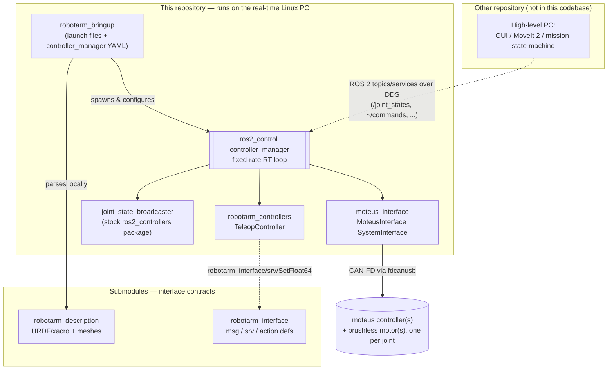

# robotarm_firmware_lnx

Real-time Linux firmware for a robot arm, built on ROS 2 `ros2_control`.

## Overview

This repository is the low-level, hardware-facing half of a distributed ROS 2
robot arm project. It runs on a dedicated PREEMPT_RT Linux PC wired directly to
the arm's [mjbots moteus](https://mjbots.com/products/moteus-r4-11) brushless
controllers over CAN-FD, and is responsible for:

- Driving the moteus controllers as ROS 2 `ros2_control` joints at a fixed,
  configurable update rate.
- Running the reactive, joint-space teleop controller that turns raw position
  targets into jerk-limited motion.
- Booting and operating **independently of any higher-level system** — it loads
  its own copy of the robot's URDF and does not require a network connection or a
  GUI/planning stack to come up safely in a stopped, "disarmed" state.

It is one piece of a larger, multi-repository system: a separate, higher-level
repository (referred to below as "the high-level PC") is expected to handle GUI,
motion planning (e.g. MoveIt 2), and overall mission/state-machine orchestration,
talking to this repository's ROS 2 nodes over the network. **That higher-level
repository is not part of this codebase** and is out of scope for this README.

This repo is for anyone building or maintaining the actual hardware-interfacing
firmware: the `ros2_control` hardware plugin, the motion controllers, and the
launch/config that brings them up on the real-time PC.

**Current state:** the arm currently has 3 configured joints (`axis1`/`axis2`/
`axis3`), but nothing here is hardcoded to that number — `moteus_interface`,
`robotarm_controllers`, and `robotarm_bringup` are all written generically
against whatever joints are declared in the URDF and config. Adding an axis is
meant to be a matter of adding a joint to `robotarm_description`'s URDF/Xacro and
configuring it in `robotarm_bringup`'s `controllers.yaml`, not a code change.
More joints and more controller options are expected as the arm grows — see
[Status / Roadmap](#status--roadmap).

## Repository Structure

| Package | Type | Role |
|---|---|---|
| [`moteus_interface`](src/moteus_interface) | Native | `ros2_control` `SystemInterface` hardware plugin that drives mjbots moteus brushless controllers over CAN-FD via the official fdcanusb USB adapter, using a from-scratch transport layer built for deterministic RT cycles. **[See its own README for the full deep dive](src/moteus_interface/README.md).** |
| [`robotarm_controllers`](src/robotarm_controllers) | Native | Custom `ros2_control` controllers. Currently ships `TeleopController`: a reactive controller that runs incoming joint position targets through [Ruckig](https://ruckig.com/) for jerk-limited online trajectory smoothing, with a runtime speed-scale service. |
| [`robotarm_bringup`](src/robotarm_bringup) | Native | ROS 2 launch files and `controller_manager` YAML configuration that bring the arm up, either against real hardware (`moteus_interface`) or a mocked system (`mock_components/GenericSystem`) for development without hardware attached. |
| [`robotarm_description`](src/robotarm_description) | **Git submodule** | URDF/Xacro, the `<ros2_control>` tag definitions, and STL meshes describing the arm's kinematics and geometry — currently 3 joints (`axis1`/`axis2`/`axis3`), with more to be added here as the arm grows. The single source of truth for the robot's shape, shared with the high-level repo. |
| [`robotarm_interface`](src/robotarm_interface) | **Git submodule** | Custom ROS 2 message/service/action definitions — interface contracts with no application logic of their own, shared between this repo and the high-level repo. Some (e.g. `SetFloat64`) are consumed here; others (`CANFDTunnel.srv`, `Mission`/`ConfigMotor`/`PlanCSV`/`PlanJointSpace`/`ReadMotorConfigs` actions) are consumed by the high-level repo rather than by anything in this one. |

`robotarm_description` and `robotarm_interface` are the only two submodules; `moteus_interface`,
`robotarm_controllers`, and `robotarm_bringup` are native to this repository.

## Architecture


```mermaid
graph TD
    subgraph other["Other repository (not in this codebase)"]
        core["High-level PC:<br/>GUI / MoveIt 2 / mission state machine"]
    end

    subgraph repo["This repository — runs on the real-time Linux PC"]
        bringup["robotarm_bringup<br/>(launch files + controller_manager YAML)"]
        cm[["ros2_control controller_manager<br/>fixed-rate RT loop"]]
        teleop["robotarm_controllers<br/>TeleopController"]
        jsb["joint_state_broadcaster<br/>(stock ros2_controllers package)"]
        hwi["moteus_interface<br/>MoteusInterface SystemInterface"]
    end

    subgraph subs["Submodules — interface contracts"]
        desc["robotarm_description<br/>URDF/xacro + meshes"]
        iface["robotarm_interface<br/>msg / srv / action defs"]
    end

    moteus[("moteus controller(s)<br/>+ brushless motor(s), one per joint")]

    core -. "ROS 2 topics/services over DDS<br/>(/joint_states, ~/commands, ...)" .-> cm
    bringup -->|spawns & configures| cm
    bringup -->|parses locally| desc
    cm --> teleop
    cm --> jsb
    cm --> hwi
    teleop -. "robotarm_interface/srv/SetFloat64" .-> iface
    hwi -- "CAN-FD via fdcanusb" --> moteus
```

- **Package split, not a monolith.** Rather than one firmware package, hardware
  access (`moteus_interface`), motion control (`robotarm_controllers`), and
  orchestration (`robotarm_bringup`) are separate packages, each independently
  buildable and swappable (e.g. mock hardware in place of `moteus_interface` for
  development).
- **Runs independent of the network.** `robotarm_bringup` parses its URDF/Xacro
  from the local `robotarm_description` submodule at startup — this PC does not
  need the high-level PC, a network connection, or RViz to come up in a safe,
  disarmed state.
- **URDF is where you add/change hardware; `controllers.yaml` is where you
  configure everything else.** Joints (and their per-joint `can_id`/
  `encoder_offset` params) are declared in `robotarm_description`'s URDF/Xacro;
  the RT loop's update rate, which controllers are active, and
  `moteus_interface`'s own runtime parameters (execution mode, transport
  timeout, USB device path, etc.) are all set in `robotarm_bringup`'s
  [`controllers.yaml`](src/robotarm_bringup/config/controllers.yaml). Neither
  `moteus_interface` nor `robotarm_controllers` hardcode a joint count or a
  specific rate — both are driven entirely by this configuration.
- **The `controller_manager` runs at a fixed, configurable rate** with three
  phases each cycle: `read()` on `moteus_interface` fetches the latest encoder/
  telemetry state, active controllers (`TeleopController`,
  `joint_state_broadcaster`) compute new setpoints from it, then `write()` sends
  those setpoints back out over CAN-FD.
- **Hardware starts disarmed.** `moteus_hardware_system` boots `INACTIVE`
  (`hardware_components_initial_state` in `controllers.yaml`); `read()` still runs
  every cycle so telemetry/`joint_states` are available immediately, but
  `TeleopController` only drives real setpoints once the hardware and controller
  are explicitly activated. See `moteus_interface`'s own README for the full
  `on_configure`/`on_activate`/`on_deactivate` lifecycle and its fault/watchdog
  behavior — that detail isn't duplicated here.
- **Low-level controllers are reactive**, not aware of overall mission state —
  that context/orchestration is expected to live in the high-level, out-of-repo
  system, which this repo's nodes talk to only via standard ROS 2 topics/services
  and the `robotarm_interface` message contracts.

## Interfaces Offered So Far

**Hardware interface (`ros2_control::SystemInterface`):**

- `moteus_interface/MoteusInterface` — drives moteus controllers as
  `position`/`velocity`/`effort` command+state joints. See
  **[src/moteus_interface/README.md](src/moteus_interface/README.md)** for
  execution modes, homing behavior, watchdog/fault handling, and the custom
  transport layer.

**Controllers (`ros2_control::ControllerInterface`):**

- `robotarm_controllers/TeleopController` — subscribes to `~/commands`
  (`std_msgs/Float64MultiArray`, raw per-joint position targets), runs them
  through Ruckig for jerk-limited smoothing, and outputs `position`+`velocity`
  commands. Exposes a `~/scale_speed` service
  (`robotarm_interface/srv/SetFloat64`) to scale velocity/acceleration/jerk
  limits at runtime.
- `joint_state_broadcaster` (stock `ros2_controllers` package) — publishes
  `/joint_states` at a configurable rate.

There is currently no trajectory-following controller (e.g. a standard
`joint_trajectory_controller`) wired up in this repo — motion today is driven
through the reactive `TeleopController` only. More controller options are
expected as the project develops.

## Usage / Getting Started

### Prerequisites

- ROS 2 Jazzy (the [devcontainer](.devcontainer/Dockerfile) is built on
  `ros:jazzy-ros-base`).
- A real-time-tuned Linux host if you intend to run against real hardware — see
  **[docs/REALTIME_SETUP.md](docs/REALTIME_SETUP.md)** for the full kernel/BIOS/
  Docker setup. None of that is required to build the code or run the mock
  (no-hardware) launch file.
- Submodules checked out:
  ```bash
  git submodule update --init --recursive
  ```

### Build

```bash
colcon build --symlink-install
source install/setup.bash
```

`moteus_interface`'s build fetches the `mjbots/moteus` C++ client library
automatically via CMake `FetchContent` (network access needed the first time).
[`colcon.meta`](colcon.meta) enables `compile_commands.json` export for
`moteus_interface` and `robotarm_controllers`, useful for `clangd`/IDE tooling.

### Devcontainer

This repo ships a [`.devcontainer`](.devcontainer) (VS Code Remote Containers)
preconfigured with the ROS 2 dependencies and the privileged/RT runtime flags
(`--cap-add=sys_nice`, `rtprio=99`, `memlock=-1`, and a bind-mount for
`/dev/ttyACM0`) needed to talk to real hardware and run RT threads inside the
container. Open the repo folder in VS Code and reopen in the container.

### Bring-up

Without hardware (mock joints, e.g. for development or RViz-only testing):

```bash
ros2 launch robotarm_bringup robotarm_mock.launch.py
```

Against real hardware:

```bash
ros2 launch robotarm_bringup robotarm_hardware.launch.py
```

Both start `ros2_control_node`, `robot_state_publisher`, and spawn
`joint_state_broadcaster` and `teleop_controller` (inactive by default — activate
it explicitly once you're ready to send motion commands). VS Code users can also
use the provided [tasks](.vscode/tasks.json): **Colcon build**, **Run Robot**,
**Run Mock**.

For the host-level real-time setup this needs before running reliably against
real hardware — PREEMPT_RT kernel, BIOS power-state tuning, udev/device
permissions for the fdcanusb adapter, Docker RT runtime flags — see
**[docs/REALTIME_SETUP.md](docs/REALTIME_SETUP.md)**.

## Related Documentation

- **[src/moteus_interface/README.md](src/moteus_interface/README.md)** — deep
  dive on the hardware interface: execution modes, homing, watchdog/fault
  handling, and the custom fdcanusb transport layer.
- **[docs/REALTIME_SETUP.md](docs/REALTIME_SETUP.md)** — turning a Mini-PC into
  a PREEMPT_RT robot controller: kernel, BIOS tuning, Docker RT flags, and
  `cyclictest` verification.
- **[docs/timing/](docs/timing/)** — `timing_analyzer.py` and recorded transport
  timing CSVs/plots for analyzing `moteus_interface`'s per-cycle transport
  latency (produced by its `time_transport` option).
- **[docs/motor_cfg/](docs/motor_cfg/)** — per-axis moteus controller register
  configuration dumps (`axis1`/`axis2`/`axis3`), kept as a backup/reference of
  each controller's calibrated configuration.

## Status / Roadmap

This is a working system driving the author's own robot arm day-to-day, but it
carries several honest rough edges:

- **Package metadata is placeholder.** Every `package.xml` in this repo
  (`moteus_interface`, `robotarm_controllers`, `robotarm_description`,
  `robotarm_interface`) still has a `TODO` `<description>` and `<license>`, and
  `robotarm_bringup`'s `package.xml` does too — only its `setup.py` states a
  license (see [License](#license) below).
- **`moteus_interface` is explicitly experimental** — single transport
  (official mjbots fdcanusb only, no SocketCAN), no retry/checksum logic, and a
  project-specific secondary-encoder homing workaround. Details and caveats are
  in its own README.
- **Only one controller exists today** (`TeleopController`); there's no
  trajectory-following controller in this repo yet, and more controller options
  are planned as the project develops.
- **Joint count is a current-state fact, not a design limit.** The arm has 3
  configured joints today; `moteus_interface`, `robotarm_controllers`, and
  `robotarm_bringup` are all written to be driven by whatever's declared in the
  URDF and `controllers.yaml`, and more joints are expected to be added as the
  arm is built out further.
- **Submodule pinning:** `robotarm_description` and `robotarm_interface` are
  tracked as git submodules at whatever commit is currently checked in; there's
  no compatibility/versioning contract documented yet between this repo and
  those submodules' evolution.

## Contributing

Issues and pull requests are welcome — parts of this repo (particularly
`moteus_interface`) are shared in case they're useful to others in the
mjbots/moteus and `ros2_control` communities, not just for this specific arm.
If you're filing an issue against `moteus_interface`, please include your moteus
firmware version and execution-mode configuration (see its README).

Given the license situation below, please check with the maintainer before
building on this code in a context where licensing terms matter to you.

## License

**There is no top-level `LICENSE` file in this repository.** License status is
currently inconsistent across packages:

- `moteus_interface`, `robotarm_controllers`, `robotarm_description`, and
  `robotarm_interface` all have `<license>TODO: License declaration</license>`
  in their `package.xml`.
- `robotarm_bringup`'s `setup.py` declares `license='Apache-2.0'`, but this isn't
  backed by an actual `LICENSE` file anywhere in the repo.

Until this is resolved, treat the code as all-rights-reserved by default (as
`moteus_interface`'s own README already states explicitly for that package).
